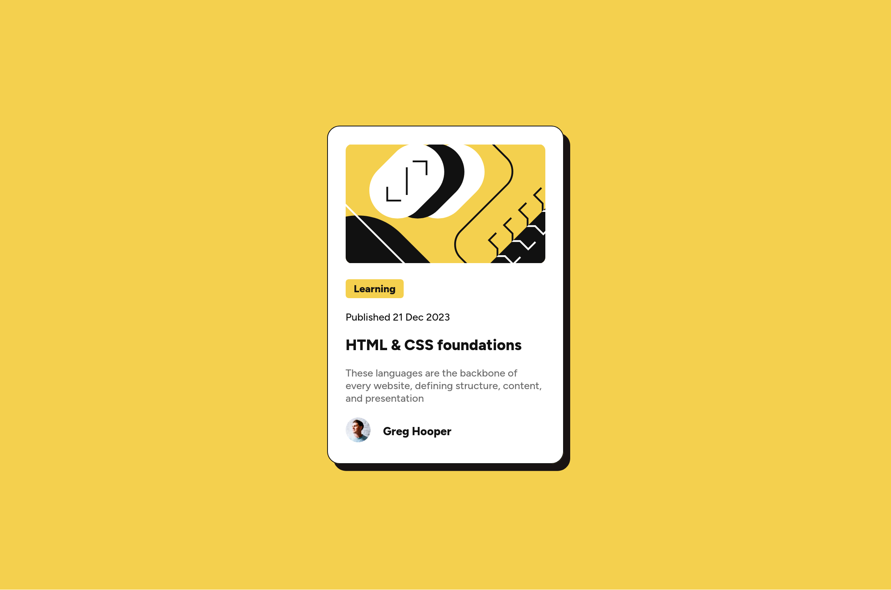

# Frontend Mentor - Blog preview card solution

This is a solution to the [Blog preview card challenge on Frontend Mentor](https://www.frontendmentor.io/challenges/blog-preview-card-ckPaj01IcS). Frontend Mentor challenges help you improve your coding skills by building realistic projects. 

## Table of contents

- [Overview](#overview)
  - [The challenge](#the-challenge)
  - [Screenshot](#screenshot)
  - [Links](#links)
- [My process](#my-process)
  - [Built with](#built-with)
  - [What I learned](#what-i-learned)
- [Author](#author)

## Overview

### The challenge

Users should be able to:

- See hover and focus states for all interactive elements on the page

### Screenshot



### Links

- Solution URL: [Here](https://www.frontendmentor.io/solutions/blog-preview-card-using-flexbox-fT99rDlJde)
- Live Site URL: [Here](https://blog-preview-card-3gftoo45b-cool-guys-projects-09f00924.vercel.app/)

## My process

### Built with

- Semantic HTML5 markup
- CSS custom properties
- Flexbox
- Mobile-first workflow
- Vite build tool

### What I learned

I learned how to structure a project, and how to configure Vite for developing and bundling a simple website, also changed the default root directory for the project to `src/`.
Also learned How to span a container `div` through the entire screen while centering its contents:

```css
.app {
  width: 100vw;
  height: 100vh;
  display: flex;
  place-items: center;
  justify-content: center;
}
```

## Author

- Github - [csaw101](https://www.github.com/csaw101)
- Frontend Mentor - [@csaw101](https://www.frontendmentor.io/profile/csaw101)
